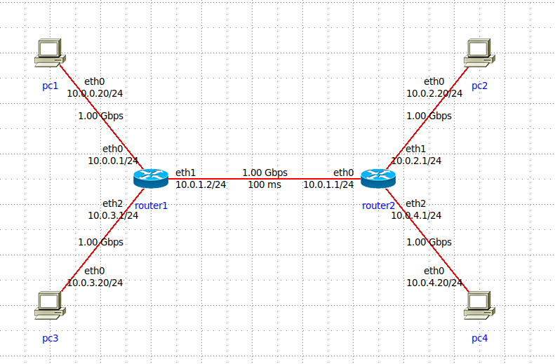

# Mini Projeto de ADS - Avaliação de Desempenho do Protocolo TCP em condições de congestionamento: cubic x reno

## Rede simulada

## Métricas

Taxa de transmissão média

## Parâmetros fixados

- Links ethernet 1 Gbps
- Links entre PC e roteador com BER 0
- Janela padrão do TCP
- Tráfego de background somente UDP

## Fatores e níveis

- Algoritmo de congestionamento
    - Cubic
    - Reno
- BER entre os roteadores 1 e 2
    - 1e-5
    - 1e-6
- Delay no link entre roteadores
    - 10ms
    - 100ms
- Tráfego de background
    - 10 Mbps
    - 500 Mbps

## Técnicas utilizadas

Simulação com IMUNES e iperf
